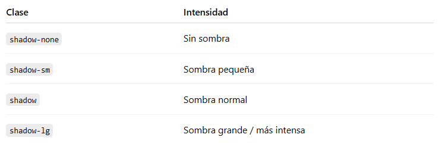

# Otros efectos opticos para usar en Bootstrap 5
## Imágenes
### Sombras
Se pueden añadir sombras con estos parámetros pero la tonalidad del color o la intensidad se deben de configurar con CSS

--

### Bordes
Bootstrap también te permite modificar los bordes de las imagenes. Por ejmplo:

- Puedes redondear imagenes y especificar el grado de redondeo 

- Puedes destacar uno de los bordes, varios o todos

--

### Filtros de imagen
Puedes añadir diferentes filtros en la imagen

-- 

### Efectos de opacidad
Esto se modifica poniendo despuestes de **opacity-** el número de porcentaje de transparencia

-- 

### Efectos hover
Puedes hacer que las imágenes reaccionen al hover usando  transformaciones pero tienes que añadir CSS

-- 

### Display
Al igual que al usar Flexbox con CSS, puedes utilizar como se comportan los elementos dentro del contenedor con:

#### d-inline 
- Hace que el elemento se comporte como un **elemento en línea**.
- Solo ocupa el **ancho necesario** para su contenido.
- Permite que **otros elementos estén al lado,** en la misma línea.
- **No acepta** márgenes verticales (margin-top, margin-bottom).

#### d-inline-block 
- Es una combinación de los dos anteriores.
- Ocupa solo el **ancho del contenido** (como inline).
- **Permite márgenes y padding verticales** (como block).
- Ideal para colocar varios elementos en línea pero con formato visual.

#### d-block
- Hace que el elemento se comporte como un **bloque**.
- Ocupa **todo el ancho disponible** del contenedor.
- Se coloca **en una nueva línea** (ningún otro elemento puede estar a su lado).
- Acepta márgenes y padding en todas las direcciones.