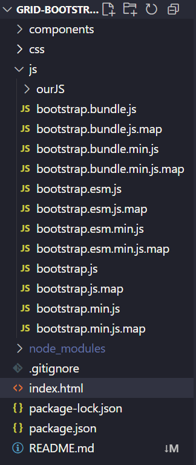

# Proyecto Responsive con Bootstrap 5.3

Este proyecto es una **maqueta base responsiva** desarrollada con [Bootstrap 5.3](https://getbootstrap.com/) para demostrar la estructura de grid, distribución flexible de contenidos y componentes reutilizables como *navbar* y *footer*.

---

## Características principales

- Sistema de **grid responsivo** basado en Bootstrap 5.3  
- Distribución clara entre `Main` (8 columnas) y `Aside` (4 columnas)  
- Sección inferior con tres columnas iguales  
- Diseño *mobile-first* adaptable a todos los tamaños de pantalla  
- Navbar y Footer cargados dinámicamente  
- Estructura lista para personalizar y escalar

---

## Tecnologías utilizadas

---

## Estructura del proyecto

---

## Responsive Design

Todo el diseño es responsive en todas las pantallas disponibles.

---

## Instalación y ejecución

Clona este repositorio y ejecuta el archivo `index.html` directamente en tu navegador:

# Clonar el repositorio

git clone https://github.com/reyes-art-car/grid-bootstrap.git

## Personalización

- **Estilos** → `css/estilos.css`  
- **Lógica de carga dinámica** → `js/ourJS/main.js`  
- **Estructura base** → `index.html`

Para la personalización del estilo **es necesario descargarse en local las librerías de Bootstrap 5.3**

---

## Licencia

Este proyecto está bajo la licencia **MIT**.  
Eres libre de usarlo, modificarlo y distribuirlo para fines personales o comerciales.

---

## Autores

Desarrollado por **Maria Reyes Artacho Carrero y Carmen Varela Iglesias**  

- [María Reyes Artacho Carrero](https://github.com/reyes-art-car)
- [Carmen Varela](https://github.com/carmenvarela)
